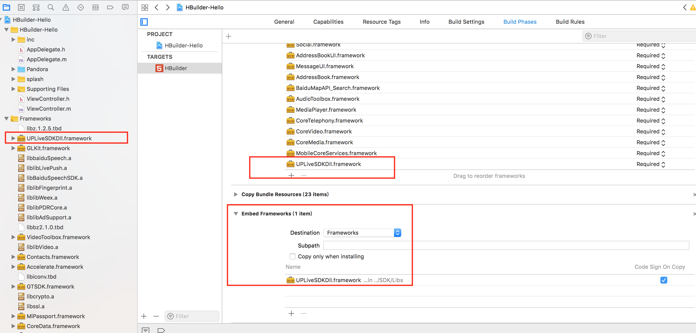

# LivePusher（又拍云直播推流）（iOS）

> **适用版本**：HBuilderX 5.0+
> **平台**：iOS (iPhone/iPad)
> **官方文档**：https://nativesupport.dcloud.net.cn/AppDocs/usemodule/iOSModuleConfig/livepusher.html
>
> **最后更新**：2025年5月

---

iOS 又拍云直播推流模块。

## 将又拍云直播推流模块依赖库及资源添加到工程

| 依赖库 | 系统库 | 依赖资源 |
|--------|--------|---------|
| `liblibLivePush.a` `libDCUniGPUImage.a` `UPLiveSDKDll.framework` | `AVFoundation.framework`、`QuartzCore.framework`、`OpenGLES.framework`、`AudioToolbox.framework`、`VideoToolbox.framework`、`Accelerate.framework`、`CoreMedia.framework`、`CoreTelephony.framework`、`SystemConfiguration.framework`、`CoreMotion.framework`、`libz.tbd`、`libbz2.tbd`、`libiconv.tbd` | 无 |

## 动态库配置

`UPLiveSDKDll.framework` 这个库是**动态库**并且**不支持模拟器**，需要添加到 **Xcode → General → Frameworks, Libraries, and Embedded Content** 中，设置为 **Embed & Sign**：

上图展示了 Xcode 中的三处配置要点：

1. **项目导航器**（左侧）：将 `UPLiveSDKDll.framework` 拷贝到项目目录（如 `libs/` 下）
2. **General → Frameworks, Libraries, and Embedded Content**（右上）：将 `UPLiveSDKDll.framework` 添加到列表，Embed 设置为 **Embed & Sign**
3. **Embed Frameworks**（下方）：确认 `UPLiveSDKDll.framework` 出现在 Embed Frameworks 列表中，勾选 **Code Sign On Copy**

## 自定义组件模式

> 注意：如果是自定义组件模式下的 `live-pusher` 组件，需要再加上 `libDCUniLivePush.a` 库。

---

## ⚠️ 重要注意事项

1. **真机调试必需**：`UPLiveSDKDll.framework` 不包含模拟器架构（仅 arm64），必须在真机上调试和运行
2. **后台限制**：iOS 对后台摄像头访问有限制，App 进入后台时需暂停推流
3. **网络环境**：推流对网络质量要求较高，建议使用稳定的 WiFi 或 4G/5G 网络
4. **与腾讯云 TUICallKit 冲突**：LivePusher 底层依赖的 SDK 与腾讯云音视频通话插件（TUICallKit）存在符号冲突，两者**不能同时集成**
5. **自定义组件模式**：若使用自定义组件模式开发，务必额外添加 `libDCUniLivePush.a`，否则 live-pusher 组件无法正常工作

---

## 交叉引用

- 上一篇：[Speech（语音输入）](speech.md)
- 下一篇：[Statistic（统计）](statistic.md)
- 相关模块：[FacialRecognitionVerify（实人认证）](facial-recognition-verify.md)（同样需要相机权限）、[Geolocation（定位）](geolocation.md)（同样需要 CoreTelephony）
